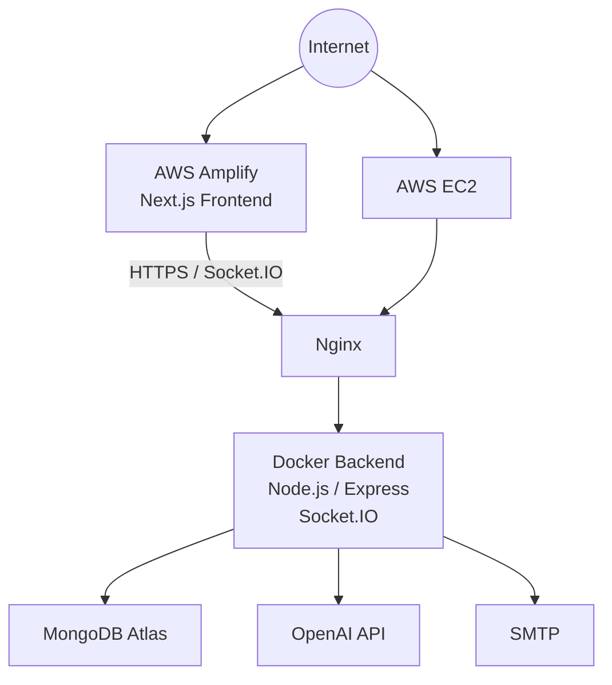

# AWS Deployment

GenContent Studio production deployment uses AWS Amplify for the Next.js frontend and an EC2-hosted Docker backend behind Nginx.

## Architecture



```text
Internet
  ├─> AWS Amplify
  │     └─ Next.js Frontend
  │          └─ HTTPS / Socket.IO
  │               └─> AWS EC2
  │                    └─ Nginx
  │                         └─ Docker Backend
  │                              ├─ Node.js / Express
  │                              ├─ Socket.IO
  │                              ├─ MongoDB Atlas
  │                              ├─ OpenAI API
  │                              └─ SMTP
  └─> AWS EC2
```

The backend container port is bound to localhost only. Public EC2 access should normally be limited to SSH from trusted addresses plus HTTP/HTTPS. Nginx provides the public HTTPS backend endpoint.

## Frontend Deployment

The frontend is deployed separately through AWS Amplify.

```text
GitHub repository
  -> AWS Amplify
  -> Next.js frontend
  -> public Amplify URL
```

In Amplify, connect the GitHub repository and choose the production branch or release process required for the project. Amplify builds the frontend from `packages/frontend`.

Configure this frontend environment variable in Amplify:

```env
NEXT_PUBLIC_API_BASE_URL=https://api.your-domain.com
```

Use the public HTTPS Nginx backend endpoint.

The same value is used by REST API calls and Socket.IO collaboration because `collaboration.js` imports `API_BASE_URL` from the frontend API client.

Amplify serves the frontend over HTTPS automatically. The backend should also use HTTPS through Nginx so the browser does not block API or Socket.IO requests as mixed content.

Do not put backend secrets in Amplify. The frontend variable above is public because it is bundled into the browser app.

Frontend deployment is not handled by `.github/workflows/deploy-backend-production.yml`. That workflow deploys only the backend Docker container to EC2.

## Backend Deployment

The backend is deployed to EC2 as a Docker container behind Nginx.

```text
GitHub Actions manual deployment
  -> SSH to EC2
  -> sync repository files
  -> build backend Docker image
  -> replace backend container
  -> Nginx proxies public HTTPS traffic to localhost:4000
```

The backend Dockerfile is:

```text
packages/backend/Dockerfile
```

Local backend development can use:

```text
packages/backend/Dockerfile.dev
```

Build from the repository root:

```bash
docker build -f packages/backend/Dockerfile -t gencontent-backend .
```

Build the local development image:

```bash
docker build -f packages/backend/Dockerfile.dev -t gencontent-backend-dev .
```

Run on EC2:

```bash
docker run -d \
  --name gencontent-backend \
  --restart unless-stopped \
  --env-file packages/backend/.env.production \
  -p 127.0.0.1:4000:4000 \
  gencontent-backend
```

The `127.0.0.1` binding keeps the backend port private to the EC2 host so Nginx is the public entry point.

Run locally:

```bash
docker run --rm \
  --env-file packages/backend/.env \
  -p 4000:4000 \
  gencontent-backend-dev
```

## Backend Environment

Create `packages/backend/.env.production` on the EC2 host. Do not commit it.

Use `packages/backend/.env.production.example` as the template and set production values for:

```env
NODE_ENV=production
PORT=4000
FRONTEND_ORIGIN=https://your-amplify-url
MONGODB_URI=
AUTH_TOKEN_SECRET=
OPENAI_API_KEY=
EMAIL_DELIVERY_MODE=smtp
SMTP_HOST=
SMTP_PORT=587
SMTP_SECURE=false
SMTP_USER=
SMTP_PASS=
EMAIL_FROM=
```

Production values are injected into Docker at runtime with `--env-file`. The backend does not load local `.env` files when `NODE_ENV=production`.

Use this split for environment values:

```text
Amplify environment variables
  -> NEXT_PUBLIC_API_BASE_URL only

GitHub production environment secrets
  -> EC2_HOST, EC2_USER, EC2_SSH_KEY only

EC2 packages/backend/.env.production
  -> MONGODB_URI, AUTH_TOKEN_SECRET, OPENAI_API_KEY, SMTP values
```

Keeping application secrets on EC2 prevents production credentials from being copied into the Docker image, frontend bundle, or GitHub workflow logs.

## Nginx

The repository template is:

```text
deploy/nginx/gencontent.conf
```

On EC2, copy or link it into the Nginx sites configuration and replace `api.your-domain.com` with the real backend domain.

### Certbot HTTPS Setup

Before running Certbot, create a DNS `A` record for the backend domain:

```text
api.your-domain.com -> EC2 public IP
```

The EC2 security group must allow:

```text
80  HTTP
443 HTTPS
```

Install Nginx and Certbot:

```bash
sudo apt update
sudo apt install nginx certbot python3-certbot-nginx -y
```

Enable the Nginx site:

```bash
sudo cp deploy/nginx/gencontent.conf /etc/nginx/sites-available/gencontent
sudo sed -i 's/api.your-domain.com/your-real-backend-domain/g' /etc/nginx/sites-available/gencontent
sudo ln -s /etc/nginx/sites-available/gencontent /etc/nginx/sites-enabled/gencontent
```

If the certificate files do not exist yet, temporarily comment out the `listen 443 ssl http2`, `ssl_certificate`, and `ssl_certificate_key` lines before the first Nginx validation. Then run Certbot:

```bash
sudo nginx -t
sudo systemctl reload nginx
sudo certbot --nginx -d your-real-backend-domain
```

Certbot creates the certificate under:

```text
/etc/letsencrypt/live/your-real-backend-domain/
```

After Certbot succeeds, make sure the final Nginx config includes:

```nginx
listen 443 ssl http2;
ssl_certificate /etc/letsencrypt/live/your-real-backend-domain/fullchain.pem;
ssl_certificate_key /etc/letsencrypt/live/your-real-backend-domain/privkey.pem;
```

Validate and reload:

```bash
sudo nginx -t
sudo systemctl reload nginx
```

Check certificate auto-renewal:

```bash
sudo systemctl status certbot.timer
sudo certbot renew --dry-run
```

The template proxies `/socket.io/` with WebSocket upgrade headers for realtime collaboration.

The port `80` server redirects to HTTPS. The port `443` server terminates TLS and proxies traffic to the Docker backend on `127.0.0.1:4000`.

## Manual GitHub Actions Deployment

The workflow is:

```text
.github/workflows/deploy-backend-production.yml
```

It is manual only through `workflow_dispatch`. It does not run on push, merge, tag, or release.

### How the workflow is started

In GitHub:

```text
Actions
  -> Deploy Backend Production
  -> Run workflow
```

The run form has two inputs:

```text
deployment_target = latest | custom
release_tag       = optional, only used when deployment_target is custom
```

Deployments should use release tags matching:

```text
vMAJOR.MINOR.PATCH
```

Example:

```text
v1.0.0
```

Use `latest` to deploy the newest matching `v*` release tag. Use `custom` when a specific release tag needs to be deployed or redeployed.

Creating the tag does not deploy production. The owner still has to manually run the workflow.

### GitHub deployment controls

Configure the GitHub `production` environment with required reviewers so only the intended owner/account can approve deployment.

Restrict deployment branches and tags for the environment to release tags only:

```text
v*
```

Required GitHub secrets:

```text
EC2_HOST
EC2_USER
EC2_SSH_KEY
```

Required GitHub environment variable:

```text
BACKEND_PUBLIC_URL
```

```text
BACKEND_PUBLIC_URL=https://api.your-domain.com
```

Application secrets such as MongoDB, OpenAI, SMTP, and auth token values should stay in the EC2 runtime env file or a production secrets manager, not in workflow logs.

### What the workflow does

```text
Owner starts workflow manually
  -> choose latest or custom release tag
  -> workflow resolves the tag
  -> GitHub production environment approval is required
  -> checkout selected release tag
  -> verify backend Docker image builds
  -> connect to EC2 over SSH
  -> sync repository files to ~/gencontent-studio
  -> rebuild backend Docker image on EC2
  -> remove old gencontent-backend container
  -> start new gencontent-backend container
  -> run public /health check through Nginx
```

The backend container is started with:

```bash
--restart unless-stopped
--env-file packages/backend/.env.production
-p 127.0.0.1:4000:4000
```

This keeps the Docker backend private to the EC2 host and lets Nginx remain the public entry point.

## Backend Update Procedure

Normal deployment:

```text
Run manual GitHub workflow
  -> build Docker image
  -> sync repository to EC2
  -> rebuild backend image on EC2
  -> replace gencontent-backend container
  -> run /health through Nginx
```

Nginx does not need to reload for normal backend deployments.

If `deploy/nginx/gencontent.conf` changes, validate the new config with `sudo nginx -t` before applying it. Do not replace a working Nginx config if validation fails.

## Smoke Tests

Verify after deployment:

- `/health` works through the public Nginx endpoint.
- The backend port `4000` is not publicly exposed.
- Login/register/project APIs work from Amplify.
- Socket.IO connects from Amplify through Nginx.
- Two authenticated sessions can join the same project.
- Presence, text collaboration, image collaboration, quick reactions, and reconnect behavior work.

## E2E Separation

`NODE_ENV=e2e` loads `packages/backend/.env.test` and uses E2E-only configuration. Production uses runtime environment variables and must not use `.env.test`, `MONGODB_URI_TEST`, `E2E_TEST_SECRET`, or `OPENAI_TEST_MODE=true`.

## Cost Precautions

Create an AWS Budget/billing alert before production use. Keep EC2 instance size conservative and stop unused resources.
